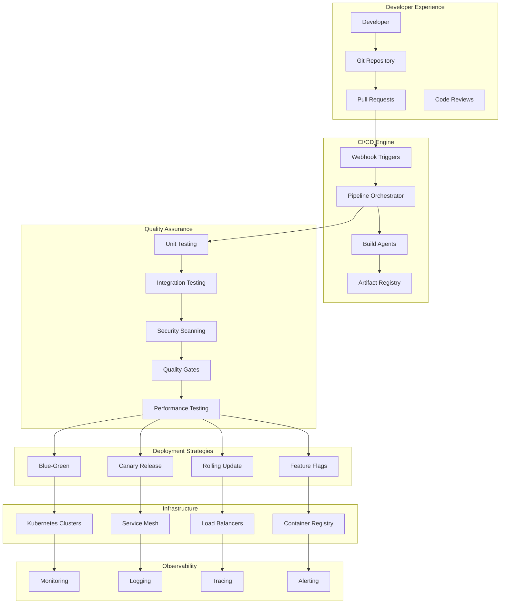
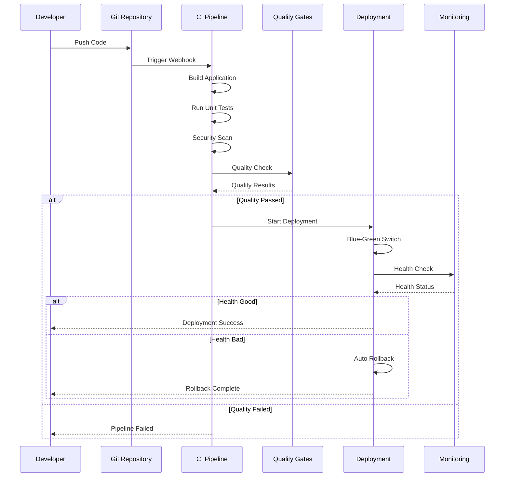

# Enterprise CI/CD Pipeline Platform

[](https://github.com/features/actions)
[](https://kubernetes.io/)
[](https://www.docker.com/)
[](https://www.terraform.io/)
[](https://opensource.org/licenses/MIT)

A comprehensive, production-ready CI/CD platform demonstrating SRE best practices with advanced deployment strategies, comprehensive testing, security scanning, and reliability features.

## 🚀 Architecture Overview

### System Architecture


### Pipeline Flow


## 🌟 Key Features

### Advanced Deployment Strategies
- **Blue-Green Deployments**: Zero-downtime deployments with instant rollback
- **Canary Releases**: Gradual traffic shifting with automated rollback
- **Rolling Updates**: Progressive deployment with health monitoring
- **Feature Flags**: Runtime feature toggling and A/B testing
- **Multi-Environment Promotion**: Dev → Staging → Production workflow

### Comprehensive Testing
- **Unit Testing**: Automated test execution with coverage reporting
- **Integration Testing**: End-to-end testing with test environments
- **Performance Testing**: Load testing and performance regression detection
- **Security Testing**: SAST, DAST, dependency scanning
- **Contract Testing**: API contract validation and compatibility

### Security & Compliance
- **Vulnerability Scanning**: Container and dependency scanning
- **Code Quality Gates**: SonarQube integration with quality metrics
- **Secret Management**: Secure handling of secrets and credentials
- **Compliance Checks**: Policy validation and audit trails
- **Supply Chain Security**: SBOM generation and verification

### Observability & Analytics
- **Pipeline Metrics**: Build time, success rates, deployment frequency
- **Deployment Analytics**: DORA metrics (Lead Time, Recovery Time, etc.)
- **Real-time Monitoring**: Health checks and automated alerting
- **Distributed Tracing**: End-to-end request tracing
- **Custom Dashboards**: GitOps and deployment visualization

## 📁 Project Structure

```
ci-cd-pipeline/
├── pipelines/
│   ├── github-actions/          # GitHub Actions workflows
│   ├── gitlab-ci/               # GitLab CI pipelines
│   ├── jenkins/                 # Jenkins pipeline definitions
│   └── azure-devops/            # Azure DevOps pipelines
├── deployment-strategies/
│   ├── blue-green/              # Blue-green deployment configs
│   ├── canary/                  # Canary deployment strategies
│   ├── rolling/                 # Rolling update configurations
│   └── feature-flags/           # Feature flag implementations
├── testing/
│   ├── unit/                    # Unit test frameworks
│   ├── integration/             # Integration test suites
│   ├── performance/             # Performance testing tools
│   └── security/                # Security testing configs
├── monitoring/
│   ├── health-checks/           # Health check endpoints
│   ├── metrics/                 # Custom metrics collection
│   ├── alerting/                # Alerting configurations
│   └── dashboards/              # Monitoring dashboards
├── security/
│   ├── scanning/                # Security scanning tools
│   ├── policies/                # Security policies
│   └── compliance/              # Compliance frameworks
├── infrastructure/
│   ├── kubernetes/              # K8s deployment manifests
│   ├── terraform/               # Infrastructure as code
│   └── helm/                    # Helm charts
└── tools/
    ├── scripts/                 # Utility scripts
    ├── docker/                  # Container configurations
    └── config/                  # Configuration templates
```

## 🛠️ Technology Stack

### CI/CD Platforms
- **GitHub Actions**: Primary CI/CD platform
- **GitLab CI**: Alternative GitLab integration
- **Jenkins**: Enterprise Jenkins pipelines
- **Azure DevOps**: Microsoft ecosystem integration
- **Tekton**: Cloud-native Kubernetes pipelines

### Deployment & Orchestration
- **Kubernetes**: Container orchestration
- **Helm**: Package management
- **ArgoCD**: GitOps continuous deployment
- **Flagger**: Progressive delivery controller
- **Istio**: Service mesh for traffic management

### Testing & Quality
- **Jest/Pytest**: Unit testing frameworks
- **Selenium/Playwright**: End-to-end testing
- **K6/Artillery**: Performance testing
- **SonarQube**: Code quality analysis
- **OWASP ZAP**: Security testing

### Monitoring & Observability
- **Prometheus**: Metrics collection
- **Grafana**: Dashboards and visualization
- **Jaeger**: Distributed tracing
- **ELK Stack**: Logging and analysis
- **Datadog**: APM and monitoring

## 🚀 Quick Start

### Prerequisites

```bash
# Required tools
docker --version          # >= 20.0
kubectl version           # >= 1.20
helm version             # >= 3.0
terraform --version      # >= 1.0

# Optional tools
argocd version           # >= 2.0
flagger -version         # >= 1.0
```

### 1. Setup Development Environment

```bash
# Clone the repository
git clone <repo-url>
cd ci-cd-pipeline

# Setup development environment
make setup-dev

# Install dependencies
make install-deps
```

### 2. Deploy Sample Application

```bash
# Deploy to development
make deploy-dev

# Run health checks
make health-check

# View deployment status
make status
```

### 3. Configure CI/CD Pipeline

```bash
# Setup GitHub Actions
make setup-github-actions

# Configure secrets
make setup-secrets

# Test pipeline
make test-pipeline
```

## 📊 Deployment Strategies

### Blue-Green Deployment

```yaml
# .github/workflows/blue-green.yml
strategy:
  type: blue-green
  traffic_split:
    blue: 100%
    green: 0%
  health_checks:
    - endpoint: /health
    - timeout: 30s
  rollback:
    auto: true
    threshold: 5% # error rate
```

### Canary Deployment

```yaml
# deployment-strategies/canary/config.yml
canary:
  steps:
    - weight: 5
      duration: 5m
    - weight: 25
      duration: 10m
    - weight: 50
      duration: 15m
    - weight: 100
  analysis:
    - metric: success-rate
      threshold: 95%
    - metric: latency-p95
      threshold: 500ms
```

### Rolling Update

```yaml
# kubernetes/rolling-update.yml
strategy:
  type: RollingUpdate
  rollingUpdate:
    maxSurge: 25%
    maxUnavailable: 25%
  progressDeadlineSeconds: 600
  revisionHistoryLimit: 5
```

## 🧪 Testing Framework

### Unit Testing
```bash
# Run unit tests
make test-unit

# Generate coverage report
make coverage

# Run specific test suite
make test-unit SUITE=authentication
```

### Integration Testing
```bash
# Start test environment
make test-env-up

# Run integration tests
make test-integration

# Cleanup test environment
make test-env-down
```

### Performance Testing
```bash
# Run load tests
make test-performance

# Generate performance report
make performance-report

# Stress testing
make test-stress
```

## 🔒 Security & Compliance

### Security Scanning
```bash
# Run security scans
make security-scan

# Generate security report
make security-report

# Check vulnerabilities
make vuln-scan
```

### Quality Gates
```yaml
quality_gates:
  code_coverage: 80%
  security_rating: A
  maintainability_rating: A
  reliability_rating: A
  duplicated_lines: < 3%
```

## 📈 Monitoring & Metrics

### DORA Metrics
- **Deployment Frequency**: Daily deployments
- **Lead Time**: Commit to production < 1 hour
- **Recovery Time**: MTTR < 30 minutes
- **Change Failure Rate**: < 5%

### Pipeline Metrics
```bash
# View pipeline metrics
make metrics

# Generate DORA report
make dora-report

# Pipeline analytics
make analytics
```

### Health Monitoring
```bash
# Check application health
make health-check

# View monitoring dashboard
make dashboard

# Check alerts
make alerts
```

## 🔧 Available Commands

```bash
# Environment Management
make setup-dev           # Setup development environment
make setup-staging       # Setup staging environment
make setup-production    # Setup production environment

# Deployment
make deploy-dev         # Deploy to development
make deploy-staging     # Deploy to staging
make deploy-production  # Deploy to production
make rollback           # Rollback deployment

# Testing
make test-all          # Run all tests
make test-unit         # Run unit tests
make test-integration  # Run integration tests
make test-performance  # Run performance tests
make test-security     # Run security tests

# Quality & Security
make lint              # Code linting
make security-scan     # Security scanning
make quality-check     # Quality gates check
make compliance-check  # Compliance validation

# Monitoring
make health-check      # Health checks
make metrics          # View metrics
make logs             # View logs
make dashboard        # Open dashboard

# Utilities
make clean            # Clean artifacts
make docs             # Generate documentation
make backup           # Backup configurations
```

## 🏗️ Example Pipelines

### GitHub Actions - Complete Pipeline

```yaml
name: Complete CI/CD Pipeline

on:
  push:
    branches: [main, develop]
  pull_request:
    branches: [main]

jobs:
  test:
    runs-on: ubuntu-latest
    steps:
      - uses: actions/checkout@v4
      - name: Run Tests
        run: |
          make test-unit
          make test-integration
          make test-security

  build:
    needs: test
    runs-on: ubuntu-latest
    steps:
      - uses: actions/checkout@v4
      - name: Build and Push
        run: |
          make build
          make push

  deploy-dev:
    needs: build
    if: github.ref == 'refs/heads/develop'
    runs-on: ubuntu-latest
    environment: development
    steps:
      - name: Deploy to Development
        run: make deploy-dev

  deploy-staging:
    needs: build
    if: github.ref == 'refs/heads/main'
    runs-on: ubuntu-latest
    environment: staging
    steps:
      - name: Deploy to Staging
        run: make deploy-staging

  deploy-production:
    needs: deploy-staging
    if: github.ref == 'refs/heads/main'
    runs-on: ubuntu-latest
    environment: production
    steps:
      - name: Deploy to Production
        run: make deploy-production
```

## 🌐 Multi-Platform Support

### GitHub Actions
- Complete workflow automation
- Environment protection rules
- Secret management
- Matrix builds and testing

### GitLab CI
- Pipeline as code
- Review apps
- Auto DevOps
- Container registry integration

### Jenkins
- Declarative pipelines
- Blue Ocean interface
- Plugin ecosystem
- Distributed builds

### Azure DevOps
- YAML pipelines
- Release management
- Artifact management
- Test plans integration

## 📚 Documentation

- [Getting Started Guide](docs/getting-started.md)
- [Deployment Strategies](docs/deployment-strategies.md)
- [Security Best Practices](docs/security.md)
- [Monitoring & Alerting](docs/monitoring.md)
- [Troubleshooting Guide](docs/troubleshooting.md)
- [API Documentation](docs/api.md)
- [Contributing Guide](docs/contributing.md)

## 🔄 Best Practices

### Pipeline Design
- **Fail Fast**: Early validation and quick feedback
- **Parallel Execution**: Optimize build times
- **Artifact Management**: Immutable artifacts
- **Environment Parity**: Consistent environments

### Security
- **Least Privilege**: Minimal required permissions
- **Secret Rotation**: Regular credential updates
- **Audit Logging**: Comprehensive audit trails
- **Compliance**: Regulatory requirement adherence

### Reliability
- **Health Checks**: Comprehensive monitoring
- **Circuit Breakers**: Failure isolation
- **Graceful Degradation**: Fallback mechanisms
- **Disaster Recovery**: Backup and restore procedures

## 🤝 Contributing

1. Fork the repository
2. Create a feature branch
3. Implement changes with tests
4. Run quality checks
5. Submit a pull request

## 📄 License

This project is licensed under the MIT License - see the [LICENSE](LICENSE) file for details.

## 📞 Support

- **Documentation**: [Wiki](../../wiki)
- **Issues**: [GitHub Issues](../../issues)
- **Discussions**: [GitHub Discussions](../../discussions)
- **Security**: [Security Policy](SECURITY.md)

---

**Created by [olaitanojo](https://github.com/olaitanojo)**
